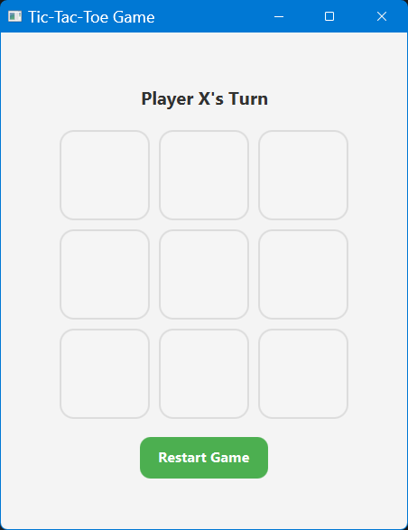
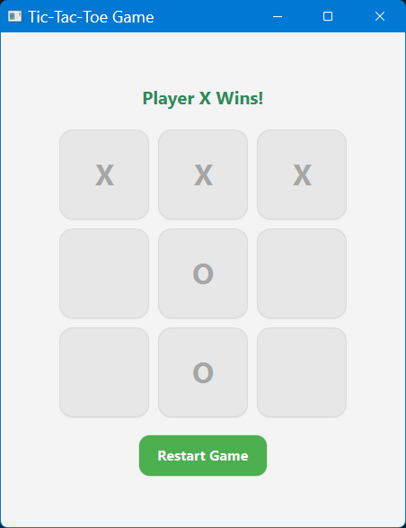
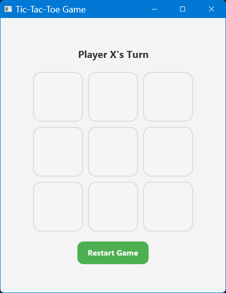
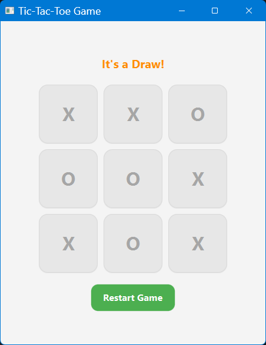

# Tic-Tac-Toe Game

## Project Overview
This is a desktop-based Tic-Tac-Toe game built using Java and JavaFX.

The game allows two players to take turns placing X and O symbols on a 3×3 board. The application automatically detects wins, draws, and supports restarting the game.

This project was built as part of a personal Java learning journey focused on learning:
- Core Java
- JavaFX GUI development
- Event handling
- 2D arrays
- Object-Oriented Programming
- Maven
- JUnit testing
- Git and GitHub workflows

---

# Features

- Interactive 3×3 Tic-Tac-Toe board
- Turn-based gameplay
- Winner detection
- Draw detection
- Restart game functionality
- Modern JavaFX UI styling
- Board disabling after game ends
- Automated JUnit tests
- Maven-based project structure

---

# Technologies Used

- Java 17
- JavaFX
- Maven
- JUnit 5
- IntelliJ IDEA
- Git & GitHub

---

# Project Structure

```text
src
├── main
│   └── java
│       └── com.prathamesh
│           ├── Main.java
│           └── GameLogic.java
│
└── test
    └── java
        └── com.prathamesh
            └── GameLogicTest.java
```

---

# How to Run the Project

## Clone Repository

```bash
git clone <your-github-repository-url>
```

---

## Open Project

Open the project in IntelliJ IDEA.

---

## Run Application

Use Maven command:

```bash
mvn javafx:run
```

---

## Run Tests

```bash
mvn test
```

---

# Automated Testing

This project includes JUnit tests for:
- Initial game state
- Move storage
- Row winner detection
- Column winner detection
- Diagonal winner detection

---

# Build Project

```bash
mvn clean package
```

Generated JAR file will be available inside:

```text
target/
```

---

# Screenshots

### Home


### Win


### Restart


### Draw


---

# Future Improvements

Possible future enhancements:
- Single-player mode with AI
- Score tracking
- Sound effects
- Animations
- Dark mode theme
- Online multiplayer support

---

## 👨‍💻 Author

**Prathamesh Kakde**
🔗 https://github.com/prathameshkakde

---